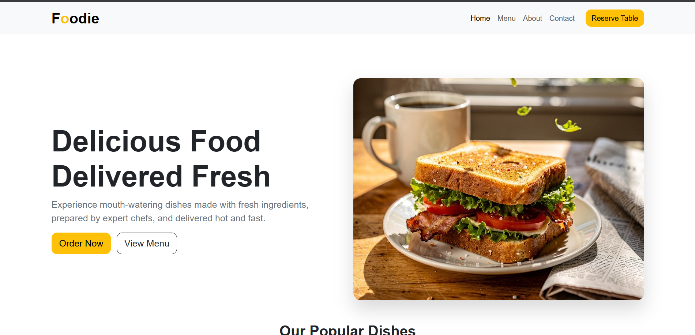

# 🍽️ Foodie - Restaurant Landing Page

A modern and responsive restaurant landing page built using **Bootstrap 5**. This project was created to learn Bootstrap by building a complete website from scratch while understanding the Bootstrap workflow and utility classes.

## 🌐 Preview

> **Live Demo:** https://your-live-link.com

> **GitHub Repository:** https://github.com/your-username/foodie

## 📸 Preview

<p align="center">
  
</p>

> Replace `preview.png` with a screenshot of your homepage and place it in the root of your project.

---

## ✨ Features

- 🍔 Responsive Navigation Bar
- 🍕 Hero Section
- 🍝 Popular Dishes Section
- ⭐ Why Choose Us Section
- 📅 Table Reservation Form
- 📞 Responsive Footer
- 🎨 Modern UI with Bootstrap Utilities
- 📱 Mobile Responsive Layout
- ✨ Smooth Hover Effects & Clean Design

---

## 🛠️ Built With

- HTML5
- CSS3
- Bootstrap 5 (CDN)
- Bootstrap Icons

---

## 📂 Sections

- Home
- Popular Dishes
- Why Choose Us
- Reservation
- Contact

---

## 📸 Screenshots

### Hero Section


### Popular Dishes


### Reservation Section


---

## 🚀 Getting Started

Clone the repository

```bash
git clone https://github.com/your-username/foodie.git
```

Go to the project folder

```bash
cd foodie
```

Open `index.html` in your browser.

---

## 📚 What I Learned

This project helped me understand:

- Bootstrap Grid System
- Containers, Rows & Columns
- Bootstrap Cards
- Bootstrap Navbar
- Bootstrap Forms
- Bootstrap Buttons
- Bootstrap Icons
- Utility Classes (Spacing, Flexbox, Typography)
- Responsive Design
- Combining Bootstrap with Custom CSS

---

## 📁 Folder Structure

```text
Foodie/
│
├── images/
│   ├── hero.jpg
│   ├── margherita.jpg
│   ├── pasta.jpg
│   ├── burger.jpg
│   └── reserve.jpg
│
├── index.html
├── style.css
├── preview.png
└── README.md
```

---

## 🎯 Future Improvements

- Add Dark Mode
- Online Reservation Backend
- Food Menu Page
- Customer Reviews Slider
- Scroll Animations
- Better Accessibility
- Performance Optimization

---

## 👨‍💻 Author

**Adarsh Kumar Jha**

GitHub: https://github.com/your-username

LinkedIn: https://linkedin.com/in/your-profile

---

⭐ If you liked this project, consider giving it a star!
